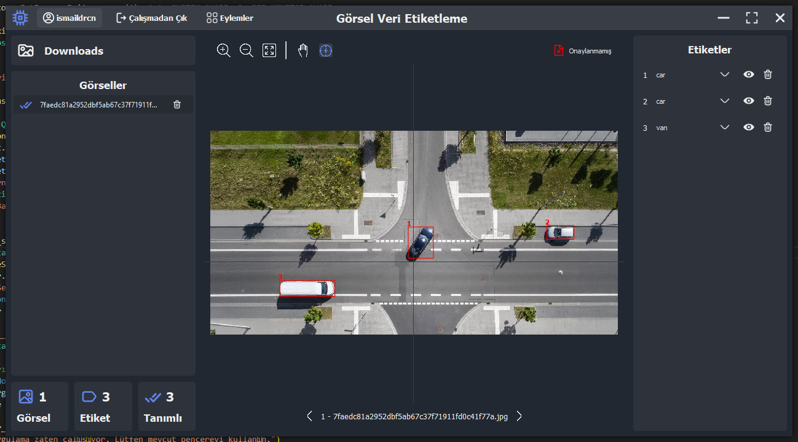
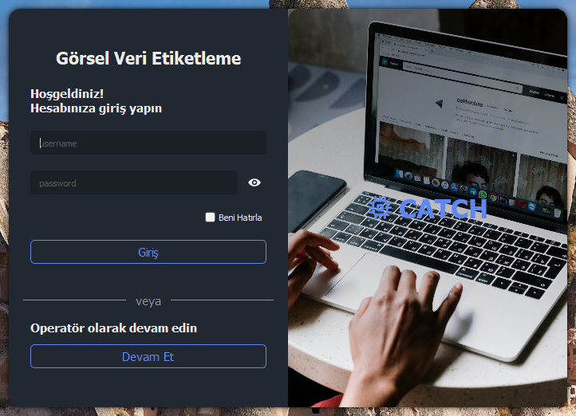

# Data Labeling Tool

A desktop application for image annotation and data labeling, designed to streamline dataset creation for machine learning and computer vision projects.

## Features

- **User Authentication:** Secure login and user management ([account/login.py](account/login.py), [account/users.py](account/users.py)).
- **Image Annotation:** Annotate images with various label types ([images/annotation.py](images/annotation.py)).
- **Project Management:** Import/export projects, manage image directories, and continue labeling from previous sessions ([mains/connector.py](mains/connector.py)).
- **Database Integration:** Store and process annotation data efficiently ([database/](database/)).
- **Customizable Labels:** Configure label widgets and settings ([label/configurator.py](label/configurator.py)).
- **Modern UI:** Intuitive interface built with Qt ([templates/ui/mainWindow.py](templates/ui/mainWindow.py)).
- **Resource Management:** Uses SVG and image resources for a rich user experience ([rcc_files/rsrc.qrc](rcc_files/rsrc.qrc)).

## Sample Images

Sample images are provided in the [`img/`](img) folder for testing and demonstration purposes:




## Installation

1. **Clone the repository:**

   ```sh
   git clone https://github.com/ismaildrcn/data-labeling.git
   cd data-labeling
   ```

2. **Install dependencies:**

   ```sh
   pip install -r requirements.txt
   ```

3. **Run the application:**
   ```sh
   python main.py
   ```

## Project Structure

- `main.py` - Application entry point
- `account/` - User authentication and management
- `database/` - Database operations and models
- `images/` - Image handling and annotation logic
- `label/` - Label configuration and widgets
- `mains/` - Main application logic and connectors
- `templates/` - UI templates
- `rcc_files/` - Resource files (SVGs, icons)
- `widgets/` - Custom widgets

## Contributing

Pull requests are welcome. For major changes, please open an issue first to discuss what you would like to change.

## License

This project is licensed under the MIT License.

## Contact

For questions or support, please open an issue or contact
